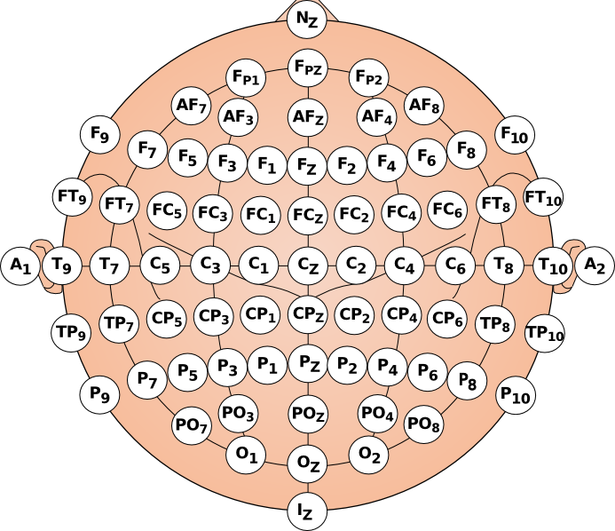
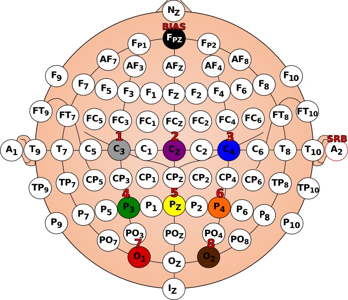

Free to use SVG files to show your best EEG electrodes in the 10-20 system.

Licence: whatever you want, it was not that a hard work.

## TODO

- a script to generate automatically the colors and labels according to a list of channels.
